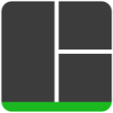
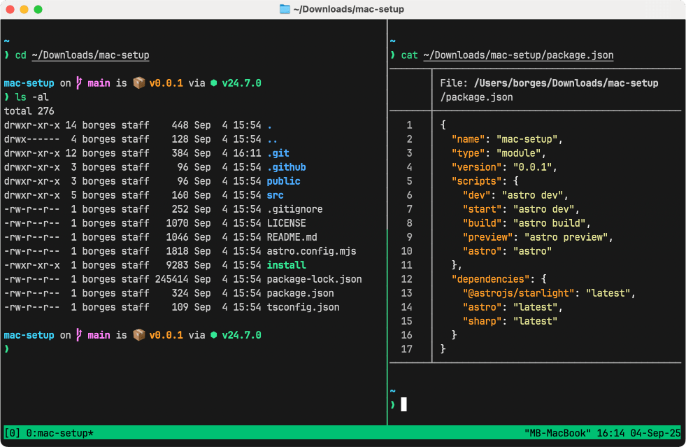

import { Steps } from '@astrojs/starlight/components';



**Tmux** is a terminal multiplexer that helps you manage multiple tasks and workflows.

With tmux, you can:

- **Sessions**: Preserve your work and keep tasks running, even if you log out or disconnect
- **Windows**: Create separate workspaces for different projects or tools within the same session
- **Panes**: Split a window into multiple views so you can monitor and interact with several processes side by side



## Installing tmux

- **Linux**: often pre-installed.

- **macOS**:

    ```bash
    brew install tmux
    ```

- **Windows**: Use via WSL (Windows Subsystem for Linux)

    ```bash
    sudo apt update
    sudo apt install tmux
    ```

## Starting and exiting tmux sessions

**Start a default session:**

```bash
tmux
```

**Start a named session:**

```bash
tmux new -s <session-name>
```

**Detach from a session:**

Leave the current tmux session running in the background so you can come back to it later.

```bash
Ctrl-b   d
```

**Exit a session:**

Close tmux completely. This will terminate the application and end all running sessions.

```bash
exit or Ctrl-d
```

## Managing tmux sessions

**List sessions:**

```bash
tmux list-sessions

tmux ls
```

**Attach to a session:**

```bash
tmux attach -t <session-name>

tmux a -t <session-name>
```

**Kill a session:**

```bash
tmux kill-session -t <session-name>
```

**Kill all sessions:**

```bash
tmux kill-server
```

## Tmux sessions

**Rename current session:**

```bash
Ctrl-b   $
```

**Choose a session from a list:**

```bash
Ctrl-b   s
```

**Close a session:**

```bash
Ctrl-d
```

## Tmux windows

**Create a new window:**

```bash
Ctrl-b   c
```

**Rename a window:**

```bash
Ctrl-b   ,
```

**Move to next / previous window:**

```bash
Ctrl-b   n
Ctrl-b   p
```

**Go to a specific window:**

```bash
Ctrl-b   0
Ctrl-b   ...
Ctrl-b   9
```

**List windows:**

```bash
Ctrl-b   w
```

**Close window:**

```bash
Ctrl-b   &
```

## Tmux panes

**Split vertically:**

```bash
Ctrl-b   %
```

**Split horizontally:**

```bash
Ctrl-b   "
```

**Move between panes:**

```bash
Ctrl-b   ← ↓ ↑ →
```

**Resize a pane:**

```bash
Ctrl-b   hold Ctrl   ← ↓ ↑ →
```

**Resize a pane (macOS only):**

```bash
Ctrl-b   hold Shift + Option   ← ↓ ↑ →
```

**Maximize/minimize a pane:**

```bash
Ctrl-b   z
```

**Change layout:**

```bash
Ctrl-b   Space
```

**Close a pane:**

```bash
Ctrl-d
```

## Searching in tmux

You can search through your tmux history using **copy mode**. This allows you to scroll back and find specific text in the buffer.

<Steps>

1. **Enter tmux copy mode:**

    ```bash
    Ctrl-b   [
    ```

2. **Start a search:**

    Search downwards:

    ```bash
    Ctrl-s
    ```

    Search upwards:

    ```bash
    Ctrl-r
    ```

3. **Type your search term and press `Enter`.**

4. **Navigate through matches:**

    - Press `n` to jump to the next occurrence.
    - Press `N` to jump to the previous occurrence.

5. **Exit copy mode:**

    Press `q` or `Escape` twice to exit copy mode.**

</Steps>

## Searching for a window in tmux

When you have multiple windows open, you can quickly jump to one based on text currently displayed inside it.

<Steps>

1. **Open the find-window prompt:**

    ```bash
    Ctrl-b   f
    ```

2. **Type your search term:**

    Type the text you are looking for, then press `Enter`.


3. **Select the matching window:**

    If there's only one match, tmux will switch to it automatically.

    If multiple windows match, you'll see a list and can choose the one you want.

</Steps>
