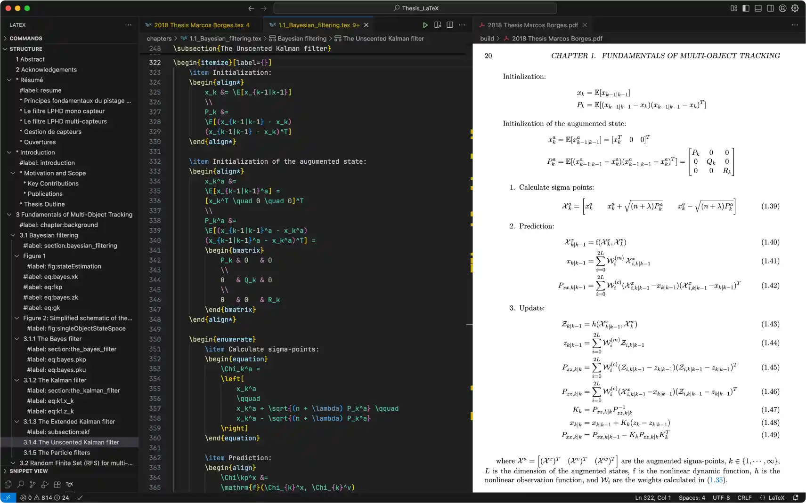

import { Steps, Aside } from '@astrojs/starlight/components';
import { Card, CardGrid } from '@astrojs/starlight/components';



I've tried several tools like **Neovim**, **Zed**, **Cursor**, and **JetBrains** editors. They're all powerful, but given my needs and minimalist approach, VS Code remains my favorite editor. My second choice is Zed, which is still in development but might take the top spot soon.

## Visual Studio Code - VS Code


[Visual Studio Code](https://code.visualstudio.com/) is a lightweight yet powerful source code editor developed by Microsoft.

It comes with several built-in features that work without requiring additional extensions, including support for Docker, Git, HTML, CSS, JavaScript, TypeScript, JSON, Markdown, YAML, and more.

## VS Code Extensions

With extensions, you can add languages, debuggers, and tools to customize your setup and enhance your development workflow.

<Aside type="caution">
Always verify the author and ensure the extension comes from a trusted source before installing. **Malicious extensions** can compromise your system or data.
</Aside>

<CardGrid stagger>
<Card title="Live Preview">


[Live Preview](https://marketplace.visualstudio.com/items?itemName=ms-vscode.live-server) allows you to preview static web projects within the editor or in an external browser.
</Card>

<Card title="LaTeX Workshop">


[LaTeX Workshop](https://marketplace.visualstudio.com/items?itemName=James-Yu.latex-workshop) provides essential features for LaTeX typesetting.
</Card>

<Card title="Python">


The [Python](https://marketplace.visualstudio.com/items?itemName=ms-python.python) extension adds editing and debugging support for Python.
</Card>

<Card title="C/C++">


The [C/C++](https://marketplace.visualstudio.com/items?itemName=ms-vscode.cpptools) extension adds editing and debugging support for C/C++.
</Card>

<Card title="rust-analyzer">


[rust-analyzer](https://marketplace.visualstudio.com/items?itemName=rust-lang.rust-analyzer) provides editing support for Rust.
</Card>
</CardGrid>

## Setting up VS Code via Mac-Setup CLI

```bash
bash <(curl -fsSL raw.githubusercontent.com/marcosborgesphd/mac-setup/main/install) vscode
```

## Setting up VS Code manually

<Steps>

1. Set up Homebrew environment

    Paste that in the terminal prompt:

    ```bash
    if [[ "$(/usr/bin/uname -m)" == "arm64" ]]; then
        HOMEBREW='/opt/homebrew' # ARM
    else
        HOMEBREW='/usr/local'    # Intel
    fi
    eval "$(${HOMEBREW}/bin/brew shellenv)"
    ```

2. Install VS Code

    ```bash
    brew install visual-studio-code
    ```

3. Add VS Code command to the terminal

    <Aside type="tip">
    You can run VS Code from the terminal by typing `code` after adding it to the `PATH`.
    Remember to restart the terminal afterward.
    </Aside>

    ```bash
    SOURCE='/Applications/Visual Studio Code.app/Contents/Resources/app/bin/code'
    TARGET='/usr/local/bin/code'
    sudo ln -snf "${SOURCE}" "${TARGET}"
    ```

4. Set VS Code as the default Git editor, diff, and merge tool

    ```bash
    git config --global core.editor 'code --wait'

    git config --global diff.tool vscode
    git config --global difftool.vscode.cmd 'code --wait --diff $LOCAL $REMOTE'

    git config --global merge.tool vscode
    git config --global mergetool.vscode.cmd 'code --wait $MERGED'
    ```

5. Install Live Preview extension

    ```bash
    code --install-extension ms-vscode.live-server
    ```

6. Install Python extension

    ```bash
    code --install-extension ms-python.python
    ```

7. Install C/C++ extension

    ```bash
    code --install-extension ms-vscode.cpptools
    ```

8. Install rust-analyzer extension

    ```bash
    code --install-extension rust-lang.rust-analyzer
    ```

9. Install LaTeX Workshop extension

    ```bash
    code --install-extension James-Yu.latex-workshop
    ```

10. Backup your VS Code settings

    <Aside type="note">
    If needed, you can recover your VS Code settings from `~/Downloads/settings.json`.
    </Aside>

    ```bash
    cp "${HOME}/Library/Application Support/Code/User/settings.json" "${HOME}/Downloads"
    ```

11. Update your VS Code settings. Copy and paste that in the terminal

    ```bash
    SETTINGS="$(cat <<'EOF'
    {
        "window.newWindowDimensions": "maximized",
        "window.title": "${folderPath}",

        "workbench.activityBar.location":"bottom",
        "workbench.startupEditor": "newUntitledFile",

        "extensions.ignoreRecommendations": true,
        "telemetry.telemetryLevel": "off",

        "editor.fontFamily": "JetBrainsMono Nerd Font",
        "editor.fontSize": 14,
        "editor.rulers": [80, 120],
        "editor.minimap.enabled": false,

        "terminal.integrated.fontFamily": "JetBrainsMono Nerd Font",
        "terminal.integrated.fontSize": 14,

        "files.trimTrailingWhitespace": true,
        "files.associations": { "*.mdx": "markdown" },

        "latex-workshop.latex.recipe.default": "Latexmk (LuaLaTex)",
        "latex-workshop.latex.outDir": "./build",
        "latex-workshop.latex.recipes": [
            { "name": "Latexmk (LuaLaTex)", "tools": ["latexmk (lualatex)"] }
        ],
        "latex-workshop.latex.tools": [
            {
                "name": "latexmk (lualatex)",
                "command": "latexmk",
                "args": [
                    "-lualatex",
                    "-shell-escape",
                    "-synctex=1",
                    "-interaction=nonstopmode",
                    "-output-directory=./build",
                    "%DOC%"
                ]
            }
        ]
    }
    EOF
    )"

    echo "${SETTINGS}" > "${HOME}/Library/Application Support/Code/User/settings.json"
    ```

</Steps>
