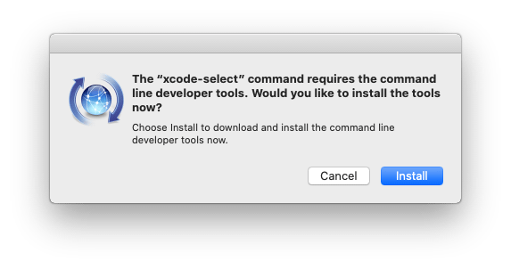

import { Steps, Aside } from '@astrojs/starlight/components';

## Xcode


[Xcode](https://developer.apple.com/xcode/) is Apple's integrated development environment (IDE) for Swift, C, and C++, providing tools to build, test, and distribute apps across all Apple platforms.

You can install Xcode via the App Store.

<Aside type="note">
Xcode takes over 13 GB of disk space! Its installation is optional.
</Aside>

## Command Line Tools


The Command Line Tools package includes the Apple LLVM compiler, linker, Make, and other essential utilities for building and debugging software from the command line on macOS.

### Installing the Command Line Tools

<Steps>

1. Remove old Command Line Tools

    When upgrading your macOS development environment, remove old versions of the Command Line Tools to avoid conflicts.

    Run the following command in the terminal:

    ```bash
    sudo rm -rf /Library/Developer/CommandLineTools
    ```

2. Install the Command Line Tools

    ```bash
    xcode-select --install
    ```

3. Confirm installation

    When the software update popup appears, click `Install` and accept the Terms of Service to proceed with the installation.

    

4. Verify installation

    After installation, the Command Line Tools are located at:

    ```bash
    /Library/Developer/CommandLineTools/
    ```

</Steps>

## Homebrew


[Homebrew](https://brew.sh) is the missing package manager for macOS.

### Installing Homebrew

Open the terminal and run the following script:

```bash
/bin/bash -c "$(curl -fsSL https://raw.githubusercontent.com/Homebrew/install/HEAD/install.sh)"
```

### Homebrew Cheat Sheet

Update Homebrew

```bash
brew update
```

Search a package

```bash
brew search <package>
```

Show package info

```bash
brew info <package>
```

List outdated packages

```bash
brew outdated
```

Upgrade a package

```bash
brew upgrade <package>
```

Upgrade all packages

```bash
brew upgrade
```
