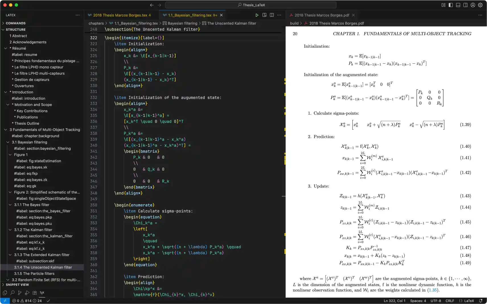

import { Steps, Aside } from '@astrojs/starlight/components';


LaTeX is a typesetting system widely used for creating professional-quality documents, especially those containing mathematical formulas, tables, and references. It allows precise control over document layout and formatting, making it ideal for academic papers, technical reports, and books.

On macOS, [MacTeX](https://tug.org/mactex) is an all-in-one installer that provides everything needed to run LaTeX.



I usually edit my LaTeX documents in **VS Code** using the **LaTeX Workshop** extension, which offers a wide range of powerful features:

- Full LaTeX language support with syntax highlighting
- Linting, snippets, and debugging tools to catch errors early
- Live PDF preview that updates on-the-fly
- Integration with Git for version control
- Auto-completion for commands, citations, and references
- Build automation to compile documents with a single command
- Forward and inverse search between source code and PDF for easier navigation

This setup makes writing, editing, and managing LaTeX documents faster and more efficient.

## Setting up LaTeX

<Steps>

1. Install MacTeX:

    ```bash
    brew install mactex-no-gui
    ```

2. Install the Open Sans font:

    ```bash
    brew install font-open-sans
    ```

3. Configure LaTeX Workshop settings in VS Code:

    <Aside type="note">
    This step is only required if you skipped the Code Editor Setup.
    </Aside>

    - Install the [LaTeX Workshop](https://marketplace.visualstudio.com/items?itemName=James-Yu.latex-workshop) extension for VS Code
    - Open the VS Code Command Palette with **⌘ ⇧ P**
    - Type *settings* and select **Preferences: Open User settings (JSON)**
    - Add the following configuration to your VS Code settings

    ```yaml
    "latex-workshop.latex.recipe.default": "Latexmk (LuaLaTex)",
    "latex-workshop.latex.outDir": "./build",
    "latex-workshop.latex.recipes": [
        { "name": "Latexmk (LuaLaTex)", "tools": ["latexmk (lualatex)"] }
    ],
    "latex-workshop.latex.tools": [
        {
            "name": "latexmk (lualatex)",
            "command": "latexmk",
            "args": [
                "-lualatex",
                "-shell-escape",
                "-synctex=1",
                "-interaction=nonstopmode",
                "-output-directory=./build",
                "%DOC%"
            ]
        }
    ]
    ```

</Steps>
