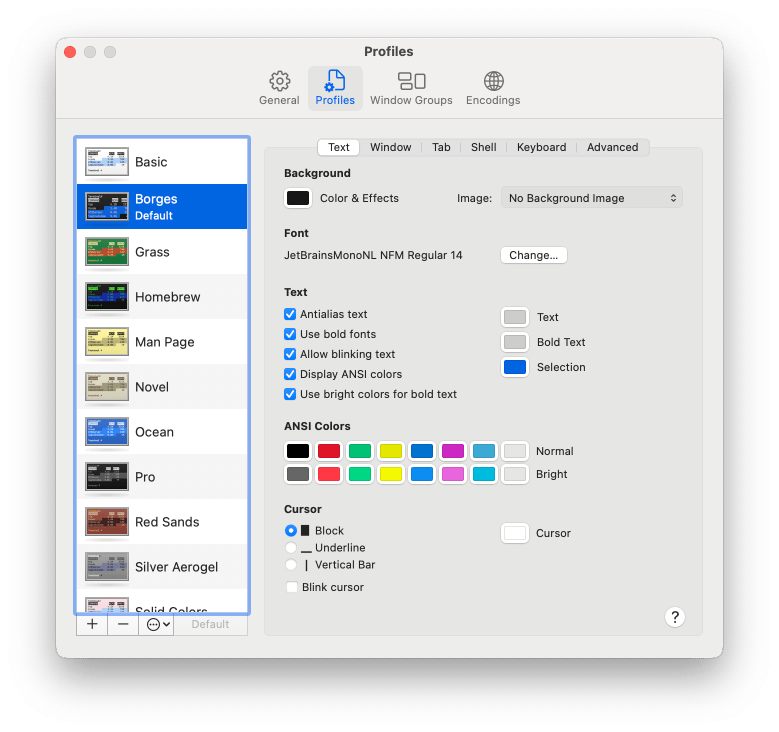

import { Steps, Aside } from '@astrojs/starlight/components';


The terminal is a text-based interface used to interact with a computer. Behind the scenes, a program called the shell interprets your commands, understands your intent, and instructs the computer to perform the desired actions.

## Terminal

As a pragmatic engineer, I keep my setup minimal, using the default macOS Terminal.


## Shell - Zsh


The Z shell or [Zsh](https://www.zsh.org) has been the default shell on macOS since October 2019. I use it with a few extra plugins:

- [zsh-autosuggestions](https://github.com/zsh-users/zsh-autosuggestions)
- [zsh-syntax-highlighting](https://github.com/zsh-users/zsh-syntax-highlighting)
- [GNU Coreutils](https://www.gnu.org/software/coreutils) for an improved `ls` command
- [Bat](https://github.com/sharkdp/bat) for `cat` with syntax highlighting

## Shell Prompt - Starship


My favorite Shell Prompt is [Starship](https://starship.rs). It works out of the box with minimal configuration and requires only a [Nerd Font](https://www.nerdfonts.com). My preferred choice is JetBrains Mono.

Starship gives me:
- Git status (branch, changes, ahead/behind)
- Language/runtime versions (Node, Python, Rust, Go, etc.)
- Package version info (npm, Cargo, etc.)
- Minimal, fast, customizable prompt style

## Setting up the macOS Terminal

<Steps>

1. Open the Terminal settings

2. Choose the default profile

3. Update the profile

    - Background: #181818
    - Font: JetBrainsMonoNL Nerd Font Mono, Regular, 14
    - Text: #CCCCCC
    - Bold Text: #CCCCCC
    - Selection: #084AD9
    - Use Bright colors for bold text

    ANSI Colors:
    - #000000 | #CD3131 | #0DBC79 | #E5E510 | #2472C8 | #BC3FBC | #3399CC | #E5E5E5
    - #666666 | #F14C4C | #23D18B | #F5F543 | #3B8EEA | #D670D6 | #29B8DB | #E5E5E5

</Steps>



## Installing Starship & Zsh via Mac-Setup CLI

```bash
bash <(curl -fsSL raw.githubusercontent.com/marcosborgesphd/mac-setup/main/install) terminal
```

## Installing Starship & Zsh manually

<Steps>

1. Set up Homebrew environment

    Paste that in the terminal prompt:

    ```bash
    if [[ "$(/usr/bin/uname -m)" == "arm64" ]]; then
        HOMEBREW='/opt/homebrew' # ARM
    else
        HOMEBREW='/usr/local'    # Intel
    fi
    eval "$(${HOMEBREW}/bin/brew shellenv)"
    ```

2. Install Starship

    ```bash
    brew install starship
    ```

3. Install Zsh plugins

    ```bash
    brew install zsh-autosuggestions zsh-syntax-highlighting
    ```

4. Install GNU Coreutils and Bat

    ```bash
    brew install coreutils bat
    ```

5. Install JetBrains Mono Nerd Font

    ```bash
    brew install font-jetbrains-mono-nerd-font
    ```

6. Backup your current `.zshrc` file:

    ```bash
    if [[ -f "${HOME}/.zshrc" ]]; then
        cp "${HOME}/.zshrc" "${HOME}/.zshrc.bkp"
    fi
    ```

7. Update your `.zshrc` file:

    <Aside type="tip">
    The `Copy to clipboard` icon copies the commands but removes comment lines. To preserve comments, manually select the text and copy it using ⌘ + C.
    </Aside>

    Copy and paste that in the terminal:

    ```bash
    ZSHRC="$(cat <<'EOF'
    # Homebrew environment
    if [[ "$(/usr/bin/uname -m)" == "arm64" ]]; then
        HOMEBREW='/opt/homebrew' # ARM
    else
        HOMEBREW='/usr/local'    # Intel
    fi
    eval "$(${HOMEBREW}/bin/brew shellenv)"

    # Zsh completion
    autoload -Uz compinit && compinit
    zstyle ':completion:*' menu select

    # Zsh plugins
    source "${HOMEBREW}/share/zsh-autosuggestions/zsh-autosuggestions.zsh"
    source "${HOMEBREW}/share/zsh-syntax-highlighting/zsh-syntax-highlighting.zsh"

    # Starship prompt
    eval "$(starship init zsh)"

    # Keybindings for history search
    bindkey '^P'   history-beginning-search-backward # Ctrl-P
    bindkey '^N'   history-beginning-search-forward  # Ctrl-N
    bindkey '^[[A' history-beginning-search-backward # Up arrow
    bindkey '^[[B' history-beginning-search-forward  # Down arrow

    # Aliases for better defaults
    alias cat="bat"
    alias grep="grep --color=auto"
    alias ls="gls --color --group-directories-first"

    # VIM environment
    export VIMINIT='syntax on | set number'

    # History
    setopt INC_APPEND_HISTORY   # Write history as commands are entered
    setopt HIST_IGNORE_ALL_DUPS # Remove older duplicate entries
    setopt HIST_REDUCE_BLANKS   # Remove extra spaces
    setopt HIST_IGNORE_SPACE    # Commands starting with space not saved
    EOF
    )"

    echo "${ZSHRC}" > "${HOME}/.zshrc"
    source "${HOME}/.zshrc"
    ```

</Steps>
